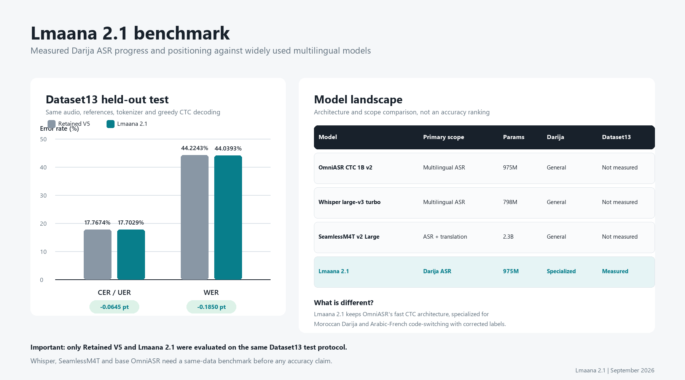

# Lmaana 2.1 - Reconnaissance automatique de la parole en Darija

Lmaana 2.1 est un modèle de reconnaissance automatique de la parole destiné
au darija marocain, y compris la parole mêlant arabe et français. Le projet
adapte l'architecture **OmniASR CTC 1B v2** avec deux corpus complémentaires :
Dataset13 pour la diversité acoustique et Lmaana clean pour des transcriptions
corrigées, notamment sur les passages en code-switching.

Ce dossier public rassemble les trois notebooks qui documentent les données,
les expériences et l'analyse finale. Les sorties importantes sont déjà
enregistrées afin de permettre leur consultation sans relancer l'entraînement.


## Résultat principal

Le checkpoint final est sélectionné à l'étape 5 000 à partir des jeux de
validation. Les jeux de test ne sont évalués qu'après cette sélection.

| Modèle | Jeu de test | CER/UER | WER |
| --- | --- | ---: | ---: |
| Lmaana V5 conservé | Dataset13 | 17,7674 % | 44,2243 % |
| **Lmaana 2.1** | **Dataset13** | **17,7029 %** | **44,0393 %** |
| Lmaana V5 conservé | Lmaana clean | 14,6099 % | **45,1385 %** |
| **Lmaana 2.1** | **Lmaana clean** | **14,6048 %** | 45,1690 % |

Lmaana 2.1 améliore le WER Dataset13 de **0,1850 point** et maintient presque
le même niveau sur Lmaana clean, avec une variation WER de **+0,0305 point**.
Il s'agit d'une amélioration incrémentale et équilibrée, pas d'un gain
important sur toutes les métriques.

## Benchmark et positionnement



La comparaison numérique concerne uniquement Lmaana V5 et Lmaana 2.1, évalués
sur exactement le même test Dataset13. OmniASR, Whisper et SeamlessM4T sont
présentés pour situer leur architecture et leur périmètre. Ils ne sont pas
classés en précision, car ils n'ont pas encore été évalués sur le même protocole.

## Contenu du dossier

### `01_data_audit.ipynb`

Audit des corpus : volumes, durées, partitions, code-switching, corrections
de transcription et visualisation de la composition des données.

### `02_training_experiments.ipynb`

Historique des versions, protocoles d'évaluation, adaptation longue, règle de
sélection et comparaison finale entre Lmaana V5 et Lmaana 2.1.

### `03_results_report.ipynb`

Rapport final avec résultats, courbes de loss et de learning rate, comparaison
des trajectoires, progression des versions et exemples de transcription.

## Données et entraînement

| Corpus d'entraînement | Exemples | Durée | Poids effectif |
| --- | ---: | ---: | ---: |
| Dataset13 | 52 892 | 263,76 h | 74,21 % |
| Lmaana clean | 74 243 | 91,68 h | 25,79 % |

Configuration principale :

- initialisation depuis le checkpoint Lmaana V5 conservé ;
- 5 000 étapes d'adaptation ;
- learning rate maximal de `1e-7` ;
- encodeur gelé pendant les 500 premières étapes ;
- accumulation de gradient sur 8 batches ;
- décodage CTC glouton, sans modèle de langue externe ;
- validation et sauvegarde tous les 500 steps.

## Lire les notebooks

GitHub affiche directement les cellules et leurs sorties. Pour une consultation
locale :

```bash
jupyter lab
```

Ouvrir ensuite les notebooks dans l'ordre `01`, `02`, puis `03`.

Les notebooks constituent un rapport reproductible, mais ne sont pas un paquet
autonome d'entraînement. Certaines cellules utilisent les rapports, scripts et
données du dépôt principal ainsi que des chemins propres à l'environnement HPC.

## Liens

- [Modèle Lmaana 2.1 sur Hugging Face](https://huggingface.co/sailu4/lmaana-2.1)
- [Code source et protocole](https://github.com/BADR-JOULAlI/darija-ctc-model)
- [Projet OmniASR](https://github.com/facebookresearch/omnilingual-asr)

## Limites

- Les gains par rapport à V5 sont modestes et proviennent d'un seul run.
- Les performances peuvent varier selon l'accent, le bruit, le domaine et le
  type de code-switching.
- Le modèle peut omettre ou substituer des mots.
- Les exemples qualitatifs ne remplacent pas une évaluation humaine complète.
- Le modèle n'est pas validé pour des décisions à fort impact.

## Auteur

**Badr Joulali**  
Projet de recherche en reconnaissance de la parole pour le darija marocain.

## Licence et attribution

Le modèle repose sur OmniASR et sur plusieurs sources de données ayant leurs
propres conditions d'utilisation. Consulter les licences du modèle de base,
du code et des jeux de données avant toute redistribution ou utilisation
commerciale.
